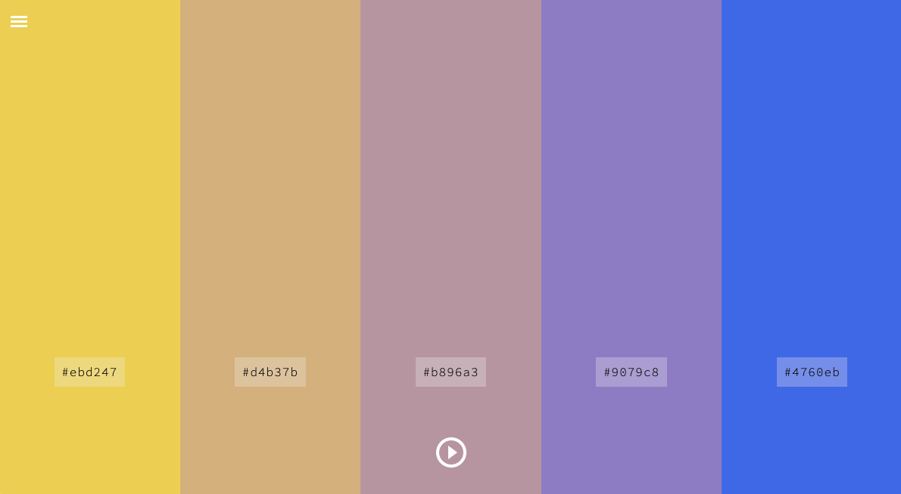

<br/>

# Color Scheme Generator

Front end application to create color themes

## Demo / Preview

[https://necessary-letter.surge.sh/](https://necessary-letter.surge.sh/)

## General Info

Developed as a personal project while following Barcelona's IT Academy React Front End Path.

Just click on the play button to generate a 5 color theme, choose from different color harmonies in the sliding menu. Once you find an interesting theme, you may download a PNG with the colors, download a JSON, or just copy the hex codes of individual colors.

## Technologies

Project created with:

- [React](https://reactjs.org/) for building all the UI. Working exclusively with functional components and React Hooks: useState, useEffect, useRef.
- [Chroma-js](http://vis4.net/chromajs/) for color conversion and interpolation.
- [Canvas API](https://developer.mozilla.org/en-US/docs/Web/API/Canvas_API) to generate a PNG image with the color theme.
- [CSS Flexbox](https://developer.mozilla.org/en-US/docs/Learn/CSS/CSS_layout/Flexbox) responsive layout.
- [Source Code Pro](https://github.com/adobe-fonts/source-code-pro) font, from [Google Fonts](https://fonts.google.com/)

## Setup

Clone and install it locally with npm:

```
mkdir color-themes
cd color-themes
git clone git@github.com:pyrenaicus/color-themes.git
npm install
npm start
```

## Features

From an initial random color, generate a palette of five colors according to different _color harmonies_[^1]:

- analogous
- complementary
- split complementary
- monochromatic

Colors were initially expressed in [HSL coordinates](https://en.wikipedia.org/wiki/HSL_and_HSV) as it seemed the most intuitive way to deal with color harmonies (complementary and analog colors can be found just applying a rotation on hue component).
That was in theory, because right away in the first tests, problems arise, due to the differences between actual _physical lightness_ of a color and _perceived lightness_.

Some interesting articles on this issue:

- [Color Spaces for Human Beings](https://www.boronine.com/2012/03/26/Color-Spaces-for-Human-Beings/) by Alexei Boronine, creator of [HSLuv](https://www.hsluv.org/).
- [Hue-angle transitions](https://rileyjshaw.com/blog/hue-angle-transitions#fnref-1) by Riley J. Shaw.
- [How To Avoid Equidistant HSV Colors](https://www.vis4.net/blog/2011/12/avoid-equidistant-hsv-colors/) by Gregor Aisch, author of [Chroma-js](https://github.com/gka/chroma.js).
- [Mastering Multi-hued Color Scales with Chroma.js](https://www.vis4.net/blog/2013/09/mastering-multi-hued-color-scales/) by Gregor Aisch.

A solution was to interpolate color transitions in [CIE Lab color space](https://en.wikipedia.org/wiki/CIELAB_color_space) using [chroma.js](https://vis4.net/chromajs/#color-scales), a small-ish zero-dependency JavaScript library (13.5kB) for all kinds of color conversions and color scales. Chroma.js is pleasantly well documented and easy to use.

### On color harmonies

#### Analogous

An analogous color palette is a group of colors that are located close to each other on the [color wheel](https://en.wikipedia.org/wiki/Color_wheel), often those are hues around 30 degrees apart from the base hue.
Analogous color schemes are found in nature, and are often soothing and relaxing to the eye.

#### Complementary

A complentary color is one that exists in the opposite side of the [color wheel](https://en.wikipedia.org/wiki/Color_wheel).
Complementary color schemes are contrasting and energizing by nature.

#### Monochromatic

Monochromatic color schemes use only one hue, varying only it's lightness and saturation.

The idea is to create a random color, and from it, different color schemes

### Contrast ratio between menu text and background colors

Using [chroma.contrast](https://vis4.net/chromajs/#chroma-contrast) to calculate contrast ratio, when contrast is below minimum, text color changes to ensure it's readable.

## TODO

Right now the app is a minimal working solution developed during a 2 weeks sprint. To keep on adding functionality like:

- pass color codes to URL search string with react router, so you can share a color theme bjust y sharing a url.
- User registration, allowing to keep a record of favorite color themes. Save the data to Firebase.
- Create color themes with variable number (btw 3 and 12) of colors. This will require a rewrite of almost everything.
- Add a page with info about color harmonies.

## CREDITS

[chroma.js](https://vis4.net/chromajs) used for all color calculations.

I read through some interesting posts on the subject, to list just a few:

- [V6: Color](https://v6.robweychert.com/blog/2018/02/v6-color/)
- [How to Generate Random Colors Programmatically](https://martin.ankerl.com/2009/12/09/how-to-create-random-colors-programmatically/)
- [Converting Color Spaces in JavaScript](https://css-tricks.com/converting-color-spaces-in-javascript/)
- [Color Harmonies in JavaScript](https://dev.to/benjaminadk/make-color-math-great-again--45of)
- [Color: From Hexcodes to Eyeballs](http://jamie-wong.com/post/color/)
- [Canvas with React.js](https://medium.com/@pdx.lucasm/canvas-with-react-js-32e133c05258), this post helped me a lot to create a PNG with the color theme.

  Have a look at the Trello board of the project for more references: [https://trello.com/b/Q91AixOQ/sprint-9](https://trello.com/b/Q91AixOQ/sprint-9)

[^1]: Colours are said to be in harmony when their juxtaposition produces a satisfying unity or balance to the viewer. Colour harmonies can be created by using two or more shades of the same hue (a monochromatic harmony), or with colors that exist on opposite sides of the [color wheel](https://en.wikipedia.org/wiki/Color_wheel) (complementary harmony).
